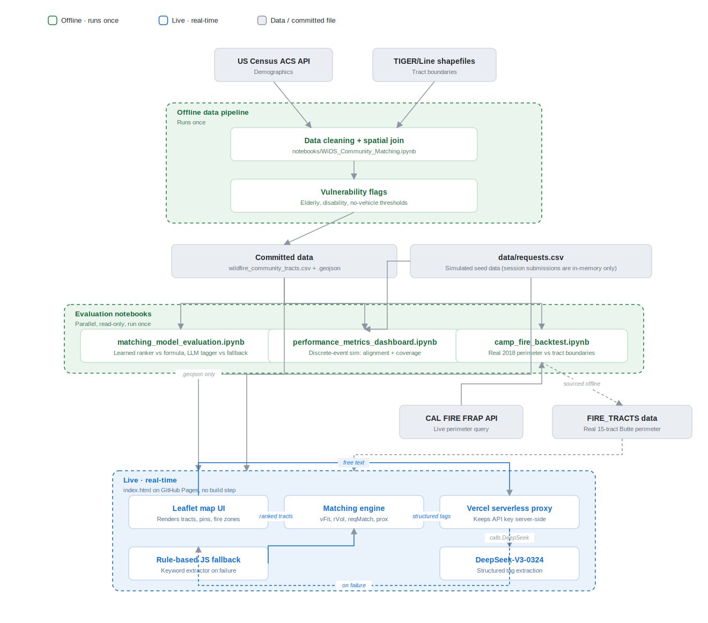

# CERM — Project Documentation

This is the internal technical reference for the Community Evacuation Resource Matcher (CERM): why it exists, exactly what data went into it and how it was cleaned, how the final system works end to end, what's been measured about it, and what's been found and fixed along the way. The [README](README.md) is the portfolio-facing summary of this same project — this document goes deeper and doesn't simplify for a skimming reader.

## Table of Contents

1. [Motivation](#1-motivation)
2. [Data](#2-data)
3. [Data Cleaning Process](#3-data-cleaning-process)
4. [The Final Solution](#4-the-final-solution)
5. [Model Evaluation and Validation](#5-model-evaluation-and-validation)
6. [Issues Found and Fixed During Development](#6-issues-found-and-fixed-during-development)
7. [Limitations and Future Work](#7-limitations-and-future-work)
8. [Repository Structure](#8-repository-structure)

---

## 1. Motivation

CERM was built for the **WiDS Datathon 2026, Route 1: Accelerating Equitable Evacuations**, which poses the question: *how can we reduce delays in evacuation alerts and improve response times for the communities most at risk?*

Wildfire evacuations disproportionately burden people with limited mobility, health vulnerabilities, or resource constraints — elderly residents, people with disabilities, and households without a vehicle. Existing tools (fire perimeter tracking, evacuation alert systems) provide situational awareness, but none of them address a specific coordination gap: **how do communities organize in real time to help vulnerable residents evacuate?**

CERM's answer is a community-driven matching tool: people offering help (transportation, medical supplies, volunteer labor) describe what they can do in free text; the system uses demographic vulnerability data, live request signals, and geographic proximity to recommend which census tracts need that help most. A large language model is used only to turn free text into structured tags — never to make the actual matching decision — which is a deliberate choice to limit hallucination risk and keep the system interpretable. The system is explicitly a **decision-support tool, not an automated dispatcher**: it surfaces where help is needed and lets people self-organize, and it refuses to operate inside active fire perimeters, redirecting those users to emergency services instead.

---

## 2. Data

CERM's demographic and geographic foundation comes from four real, independently-sourced datasets. A fifth (simulated request data) exists because the prototype has no real usage history to draw from.

| Source | What it provides | Where it's used |
|---|---|---|
| **US Census ACS 5-Year Survey (2023)**, tables `DP02` and `DP04` | Tract-level demographic percentages | `notebooks/WiDS_Community_Matching.ipynb` — the vulnerability flags that drive the matching engine's `vFit` term |
| **Census TIGER/Line shapefiles** (`tl_2025_06_tract`) | Tract polygon boundaries | Same notebook — spatial join to attach geometry to the ACS rows, and the source of all tract polygons rendered on the live map |
| **Watch Duty / CalFire** | Historical fire perimeter records, used conceptually for the safety constraint | Referenced in the original design; superseded for Butte County specifically by the CAL FIRE FRAP pull described in Section 5.3 |
| **CAL FIRE FRAP historical fire perimeter database** (`services1.arcgis.com/.../California_Historic_Fire_Perimeters`) | The *actual* 2018 Camp Fire polygon, queried live | `notebooks/camp_fire_backtest.ipynb` — real-world validation of the fire-exclusion safety constraint |
| **Simulated request data** (`data/requests.csv`) | 209 synthetic help requests across the three demo counties, in the same schema real user submissions would have | The live app's demand signal (`rVol`, `reqMatch`), and the input to `performance_metrics_dashboard.ipynb` |

### The five ACS variables pulled

| ACS Variable | Description |
|---|---|
| `DP02_0015PE` | % Households with a person 65+ (elderly) |
| `DP02_0072PE` | % Population with a disability |
| `DP02_0022PE` | % Households with children under 18 |
| `DP04_0058PE` | % Households without a vehicle |
| `DP05_0001E` | Total population |

Only three of these (elderly, disability, no-vehicle) became the vulnerability flags used downstream. The children variable was pulled and explored in the notebook's EDA, but was **not** carried into the flag system or the matching engine — it's dropped at export time. This isn't documented anywhere else in the repo; it's a real, intentional exclusion, not an oversight, but the notebook doesn't explain why it was excluded.

---

## 3. Data Cleaning Process

Everything below is from `notebooks/WiDS_Community_Matching.ipynb`, which is the single source of truth for how raw Census/TIGER data becomes the `data/wildfire_community_tracts.csv` and `.geojson` files the live app and every evaluation notebook depend on.

### 3.1 Acquisition

Raw ACS data is pulled once via a direct Census Bureau API call (`api.census.gov/data/2023/acs/acs5/profile`, scoped to `state:06` — California, all tracts) and saved to `CA Census Tract Demographic Info.csv`. This file (and the TIGER shapefile it's later joined against) are both gitignored — they're large, and anyone re-running the pipeline is expected to fetch them fresh rather than have them committed.

### 3.2 Loading and joining

Two quirks in the raw ACS export are handled explicitly:
- Row 0 of the CSV is a duplicate header row and is dropped.
- `GEO_ID` arrives with a `1400000US` prefix (e.g. `1400000US06007000100`); this is stripped down to the bare 11-digit tract GEOID (`06007000100`) used as the join key everywhere else in the project.

The cleaned ACS table is then left-joined to the TIGER/Line tract shapefile on `GEOID`, and the resulting GeoDataFrame is reprojected to **EPSG:4326** (WGS 84) — required for both GeoJSON export and for the coordinates to line up correctly on the Leaflet web map.

ACS uses large negative sentinel integers (`-666666666`, `-999999999`) to mark suppressed or missing values in specific tracts. These are explicitly replaced with `NaN` before any further processing, rather than being treated as real (extremely negative) percentages.

### 3.3 Missing data

After the sentinel replacement, any tract missing a value in one of the three vulnerability columns (elderly / disability / no-vehicle) is dropped entirely via `dropna`. The notebook prints the before/after tract counts and percentage dropped so this step is auditable, but doesn't hardcode or report the exact number in its markdown — it's computed fresh each run.

### 3.4 Statewide EDA

Before narrowing to any specific counties, the notebook explores the **full California dataset** (~8,000 tracts) to establish a baseline for each variable:
- **Elderly households**: roughly normal, centered around 32%.
- **Disability**: right-skewed, most tracts in the 5–15% range with a long tail to ~50%.
- **No-vehicle households**: strongly right-skewed — the vast majority of tracts are below 10% (California is overwhelmingly car-dependent), with a thin tail past 40% concentrated in a handful of dense urban tracts.
- **Correlation**: elderly and disability are moderately positively correlated statewide (~0.4); no-vehicle and disability are also moderately correlated. No pairwise correlation exceeds 0.5 — the notebook's stated conclusion is that the three dimensions are related but not redundant, which is the justification for treating them as three separate flags rather than collapsing them into one composite score.

### 3.5 County selection

This is the step that determines which counties CERM can even operate in, and it's more deliberate than "pick three counties" — it's a two-stage filter plus a ranking:

1. **Size filter**: a county must have at least 50 census tracts, so that a 75th-percentile (Q3) threshold computed within that county is statistically meaningful rather than noise from a handful of tracts.
2. **Heterogeneity filter**: a county must have real internal variation in at least one of the three vulnerability dimensions (elderly std ≥ 3, disability std ≥ 2, or no-vehicle std ≥ 2). Without this, every tract in a county would look alike and a within-county percentile threshold would be meaningless.
3. **Suitability ranking**: counties that pass both filters are scored by summing the standardized (z-scored) mean and standard deviation across all three dimensions — rewarding counties that are both high-need *and* internally varied enough for flagging to be informative. The top 5 by this score were selected for the notebook's full EDA: **Riverside, San Francisco, Placer, Butte, and Shasta**.

### 3.6 Narrowing five counties to the three the live app actually uses

The notebook's county-specific EDA (Section 8) runs the same set of plots — histograms, a Spearman correlation heatmap, and choropleth maps — independently for all five selected counties. From those five, the live demo narrows to **Butte, Shasta, and Riverside**, and the reasoning is explicit in the notebook's own summary:

> Butte and Shasta were chosen for their direct wildfire history — both have experienced catastrophic fires (the 2018 Camp Fire in Butte; the 2018 Carr Fire in Shasta) and show elevated elderly and disability rates that make evacuation resource matching most consequential. Riverside was chosen to represent a large, car-dependent Southern California county with a high concentration of retirement communities, providing geographic and demographic contrast to the two rural Northern California counties.

San Francisco and Placer were part of the EDA but never made it into the deployed app or its data exports — worth knowing if you're trying to reconcile the notebook's plots against what's actually in `data/`.

### 3.7 Q3 threshold flagging

For each of the three vulnerability dimensions, a **75th-percentile threshold is computed independently within each county** (not statewide). A tract is flagged (`1`) on a given dimension if its value exceeds its own county's Q3 for that dimension. By construction, roughly 25% of tracts in each county are flagged per dimension — deviations from exactly 25% just reflect ties at the boundary value.

The stated rationale for *per-county* (rather than statewide) thresholds: a "high elderly" rate in Shasta looks nothing like a "high elderly" rate in San Francisco, and using one statewide cutoff would systematically under-flag rural counties and over-flag dense urban ones. A within-county Q3 threshold means a flag always means "elevated relative to your local peers," which is the semantics the matching engine actually wants.

A tract's three flags are summed into `total_flags` (0–3), which is further collapsed into a qualitative `preparedness_tier`: 0–1 flags is "Standard Preparedness," 2 is "Elevated Concern," 3 is "High Priority." The live app doesn't currently surface `preparedness_tier` in the UI — it's computed and exported, but the matching engine works directly off the three binary flags and `total_flags`, not the tier label.

### 3.8 The flags are the single most load-bearing output of this notebook

`flag_high_elderly`, `flag_high_disability`, and `flag_low_vehicle_access` are exactly the three fields the live matching engine reads to compute `vFit` (see [4.2](#42-the-matching-engine)) — not an exploratory side artifact. (An earlier version of this notebook's Section 9 markdown claimed the opposite — that these flags were "not used in our final solution" — while the notebook's own Section 13 summary correctly described them feeding the matching pipeline. That self-contradiction has since been fixed in the notebook; see [6.9](#69-the-notebook-contradicted-itself-about-whether-the-flags-were-used).)

### 3.9 Export

Two files are written, both consumed downstream (the CSV by nothing in the live app currently — see [6](#6-issues-found-and-fixed-during-development) — the GeoJSON by everything):

| File | Format | Consumer |
|---|---|---|
| `data/wildfire_community_tracts.csv` | Tabular, no geometry | Read by the evaluation notebooks; **not** fetched by the live browser app |
| `data/wildfire_community_tracts.geojson` | Tract polygons + all flags | Fetched directly by `index.html` on load, and read by all three evaluation notebooks |

Final column set: `GEOID`, `NAME`, `county_fips`, `county_name`, `Total Population`, the three vulnerability percentages, the three binary flags, `total_flags`, and `preparedness_tier`.

---

## 4. The Final Solution



### 4.1 Two independent halves

The system splits cleanly into an **offline half** (four Jupyter notebooks, none of which the live site depends on at runtime) and a **live half** (a single static HTML file with no build step, hosted on GitHub Pages). Nothing in the offline half is called at request time by the live app — the notebooks either produce the committed data files the app reads, or independently evaluate the app's own logic against that same data.

### 4.2 The matching engine

Each candidate census tract is scored against a helper's parsed offer using four weighted components:

```
score = 0.25 · vFit + 0.15 · rVol + 0.25 · reqMatch + 0.35 · prox
```

- **`vFit`** (vulnerability fit) — the mean of up to three of the tract's binary flags (elderly, disability, no-vehicle), gated by which beneficiary tags the helper's offer mentioned. If the helper said "general," all three flags count.
- **`rVol`** (request volume) — the tract's live unresolved-request count, normalized against the maximum count seen across candidate tracts in the same county.
- **`reqMatch`** — the fraction of the tract's unresolved requests whose category overlaps the helper's offered service tags.
- **`prox`** (proximity) — `1 / (1 + distance_km / 10)`, a 10 km half-decay curve computed via haversine distance from the helper's geocoded location to the tract's centroid.

Proximity carries the highest weight (0.35) — under emergency conditions, minimizing travel time was judged more important than a theoretically perfect vulnerability match. Candidate tracts are filtered to the helper's selected county, excluded entirely if they fall inside an active fire perimeter, and require either a nonzero `total_flags` or at least one active request to be considered at all.

### 4.3 Free-text categorization

A helper's or requester's free text is sent to a Vercel serverless proxy (which holds the actual DeepSeek API key server-side — the browser never sees it), which calls **DeepSeek-V3-0324**. The model is prompted to extract three tag categories and return only JSON:

- **Service tags**: transportation, mobility assistance, heavy lifting, medical, food distribution, volunteer labor, childcare
- **Resource tags**: water, food, medicine, clothing, fuel, equipment, tools, first aid
- **Beneficiary tags**: elderly, disability, no vehicle, families, children, general

This is the system's one explicit interpretability guardrail: the LLM only ever produces tags. It never sees tract data, never computes a score, and never picks a recommendation — that's entirely the matching engine's job, working from structured tags alone. If the proxy call fails (network error, or the shared account's quota running out — which happened for real during evaluation; see [5](#5-model-evaluation-and-validation)), a rule-based keyword extractor (`fallbackExtract` / `fallbackExtractRequest`) produces the same tag shape from simple substring matching, and the app keeps working.

### 4.4 Fire-aware safety constraint

Tracts inside `FIRE_TRACTS` for the active county are excluded from matching entirely, and a user whose location falls inside one is redirected to a message pointing them to 911 and immediate evacuation guidance instead of the matching UI. `FIRE_TRACTS['Butte']` is now the real 15-tract 2018 Camp Fire perimeter, pulled from CAL FIRE's FRAP historical database and intersected against the tract boundaries in this repo (see [6.1](#61-fire_tractsbutte-was-a-single-wrong-tract)) — `FIRE_TRACTS['Shasta']` and `FIRE_TRACTS['Riverside']` are still single-tract placeholders that have not been through the same real-perimeter validation.

### 4.5 Privacy design

Requesters see only an aggregate count of open requests per tract, never individual request details. Helpers see a request's (simulated, non-residential) address but no personal contact information. No part of the current prototype persists data beyond the browser session — there is no backend, no database, and no user accounts; everything a session creates (a requester's own submission, a helper's tract selection) lives in an in-memory JavaScript object and is lost on refresh.

### 4.6 Tech stack

| Layer | Technology |
|---|---|
| Frontend | HTML5, CSS3, vanilla JavaScript, Leaflet.js |
| Hosting | GitHub Pages (static site, no build step) |
| LLM | DeepSeek-V3-0324, via a Vercel serverless proxy |
| Geocoding | OpenStreetMap Nominatim |
| Data pipeline / EDA | Python — pandas, geopandas, NumPy, scikit-learn, seaborn, matplotlib |
| Data sources | US Census ACS 5-Year (2023), TIGER/Line shapefiles, CalFire/Watch Duty, CAL FIRE FRAP historical perimeters, simulated request data |

---

## 5. Model Evaluation and Validation

The original datathon submission proposed five performance metrics and two adoption metrics but computed none of them — there was no backend or event log to compute them from. Four notebooks, built after the initial submission, turn as much of that proposal into real, reproducible numbers as the available data allows.

### 5.1 `matching_model_evaluation.ipynb`: is the fixed-weight formula the best formula?

The live scoring formula was ported line-for-line from `index.html` (not reimplemented from scratch) and benchmarked against a learned linear model and a gradient-boosted tree model, all trained on the identical four inputs (`vFit`, `rVol`, `reqMatch`, `prox`) — no extra information given to the learned models. Ground truth is a documented **synthetic** hypothesis (real acceptance-history data doesn't exist for this prototype): that real helpers value proximity, and value vulnerability only where it's paired with an actual matching request — an interaction the fixed linear formula structurally cannot represent, because it adds `vFit` and `reqMatch` independently rather than multiplying them.

| Model | NDCG@3 | MRR (true top-1) | Mean Spearman |
|---|---|---|---|
| CERM baseline (fixed weights) | 0.872 | 0.585 | 0.606 |
| Linear regression (learned linear) | 0.820 | 0.445 | 0.698 |
| Gradient boosted trees (learned nonlinear) | **0.919** | **0.663** | **0.715** |

The tree model wins on every metric. The linear model is a genuinely mixed result — better overall rank correlation than the baseline, but *worse* at picking the single best tract — which is itself evidence for the interaction hypothesis: only a model that can represent `vFit × reqMatch` jointly (not just weight them differently) improves top-1 accuracy. A partial dependence plot (`images/gbt_interaction_pdp.png`) confirms the tree model learned exactly that joint pattern.

The same notebook evaluates DeepSeek against the rule-based fallback on 20 hand-labeled free-text offers:

| Extractor | Mean F1 (service + beneficiary tags) |
|---|---|
| Rule-based fallback | 0.548 |
| DeepSeek-V3 | 0.789 |

While running this, the shared Vercel/DeepSeek proxy actually ran out of its free-tier monthly credits mid-evaluation (`"You have depleted your monthly included credits"`) — a real operational failure, not simulated. Every real LLM response that succeeded is cached to `notebooks/llm_tag_cache.json`, so re-running the notebook doesn't re-burn the shared quota.

### 5.2 `performance_metrics_dashboard.ipynb`: turning proposed metrics into real numbers

A discrete-event simulation (real requests, real matching logic, simulated arrival timestamps since none exist in the source data) computes:

- **Request Alignment Score: 79.7%** (n=64 assignments to tracts with requests)
- **Mean Accepted Recommendation Rank: 3.62** (n=73, ideal is 1.0 — corroborates the interaction-capture finding above)
- **Demand Coverage**, broken out by vulnerability flag — every vulnerable-flagged group (elderly, disability, no-vehicle) got resolved faster than the overall population, an emergent side effect of `vFit` boosting those tracts' scores rather than an engineered outcome.

Evacuation Efficiency and both adoption metrics (user signups, active users during fire events) are explicitly *not* computed — they require real deployment telemetry (before/after evacuation timestamps, signup/session logs) that a backend-less static prototype cannot produce. The notebook names this gap rather than fabricating numbers for it.

### 5.3 `camp_fire_backtest.ipynb`: checking the design against a real disaster

This is the only evaluation notebook that uses zero simulated data. It fetches the real 2018 Camp Fire perimeter live from CAL FIRE's official FRAP historical database (verified against public record: alarm date 2018-11-08, 153,336 acres, Butte Unit — all match) and intersects it against the real tract boundaries already in this repo.

**Finding 1 — the safety constraint was geographically wrong.** The real fire crossed 15 Butte County census tracts. The app's original single hardcoded "fire zone" tract for Butte did not intersect the real perimeter at all — it sat outside the burn area entirely. This directly motivated the fix described in [6.1](#61-fire_tractsbutte-was-a-single-wrong-tract).

**Finding 2 — the vulnerability-weighting rationale is partially, honestly supported.** Comparing the real ACS data for the 15 affected tracts against the rest of Butte County:

| Indicator | Affected tracts (n=15) | Rest of county (n=39) |
|---|---|---|
| % Households with elderly | 46.5 | 31.4 |
| % Population with disability | 17.2 | 16.9 |
| % Households without vehicle | 4.4 | 6.5 |

Elderly concentration is meaningfully higher in the affected tracts — consistent with the well-documented fact that 80% of the Camp Fire's 85 fatalities were over 65 [1][2][3]. Disability and no-vehicle rates show essentially no signal (disability) or the *opposite* pattern (no-vehicle, lower in affected tracts) — a genuine, unforced result that argues against treating `vFit`'s three flags as interchangeable evidence of risk.

*(Note: this ACS data is a 2023 5-year estimate, not a 2018 snapshot — Paradise's population changed substantially after the disaster. The comparison is a check on whether the same geography still reads as disproportionately vulnerable years later, read alongside the independently-sourced pre-fire demographic record, not a reconstruction of exact pre-fire conditions.)*

[1] [Camp Fire (2018) — Wikipedia](https://en.wikipedia.org/wiki/Camp_Fire_(2018)) · [2] [Camp Fire of 2018 — Britannica](https://www.britannica.com/event/Camp-Fire-of-2018) · [3] [Camp Fire: By the Numbers — PBS Frontline](https://www.pbs.org/wgbh/frontline/article/camp-fire-by-the-numbers/)

### 5.4 The original team's baseline comparison: a different kind of evidence

`images/MetricPlot.png`, referenced in both the README and the original notebook's Section 12, compares CERM against random matching, distance-only matching, and vulnerability-only matching with a qualitative High/Medium/Low table. **This figure is not generated by any cell in this notebook or any code in this repo** — it isn't reproducible from what's committed here, and no script produces it. It appears to be an illustrative figure made for the pitch deck rather than a rigorously computed simulation, unlike the three notebooks above which all produce their numbers from code you can re-run. Worth knowing if you're asked to defend that specific chart.

---

## 6. Issues Found and Fixed During Development

These were all discovered by actually reading the code or backtesting it against real data, not assumed — each is a real bug that shipped at some point and was later corrected.

### 6.1 `FIRE_TRACTS['Butte']` was a single, wrong tract

The original hardcoded fire-exclusion tract for Butte County (`06007000700`, Census Tract 7) does not intersect the real 2018 Camp Fire perimeter at all. Found via the Camp Fire backtest ([5.3](#53-camp_fire_backtestipynb-checking-the-design-against-a-real-disaster)); fixed by replacing it with the real 15-tract perimeter derived from CAL FIRE's FRAP database.

### 6.2 The fire-warning banner and the exclusion logic disagreed with each other

The static "3 Fire Zones Active" banner text displayed "Butte: Census Tract 21" — and Census Tract 21 (`06007002100`) genuinely *is* one of the real affected tracts. But the `FIRE_TRACTS` GEOID actually driving the exclusion logic pointed to Census Tract 7 instead. The display text and the functional code had silently drifted apart, most likely a transposed digit (`000700` vs. `002100`) at some point in the app's history. Both are now consistent with the real 15-tract set.

### 6.3 The Helper "select this tract" button was completely unreachable

`"+Select — I will go here"` only ever existed inside `buildPopup()`, a Leaflet marker popup. At some point the tract-click and pin-click handlers were rewritten to open a custom side panel (`showTractRequestsPanel`) instead of a native Leaflet popup, and the select button never got carried over into that new panel. The result: `selectedTracts` (the entire "Your selection" feature, including its own map legend entry) had no reachable UI path to ever be populated. Fixed by adding a working select/deselect button directly into the panel that's actually shown, wired to the existing `toggleSelectTract()` logic.

### 6.4 The "clicked to view a tract" state had no color and no legend entry

Clicking a tract to view its requests only bumped fill opacity slightly and changed the border color — it never set an actual fill color, so it stayed the same pale default and read as "washed out." It also had no legend entry, so it was easy to confuse with the (visually and functionally different) "Your selection" state. Gave it a deliberate blue fill and a "Viewing" legend row.

### 6.5 The "Your selection" highlight didn't match its own legend

Once 6.3 made the select button reachable, the actual selected-tract highlight (35% opacity fill, no border) was still too faint to read as the bold solid green the legend promised. Bumped to 55% opacity plus an explicit 2.5px green border.

### 6.6 Legend swatches were circles for things that are all polygon fills

All four original legend items (tract, fire zone, suggested tract, selection) represent census-tract *area* styling on the map, not point markers — but the legend used circular swatches for all of them, which reads as "these are pins." Changed to rounded squares.

### 6.7 Data gaps that weren't bugs, but were misleading

Butte County originally had exactly one simulated request per tract, everywhere, with zero multi-request tracts — while Riverside had 45. This wasn't a bug (the underlying generation process was just unlucky for Butte specifically), but it made every visible pin in the default county view read "1," which looked like a data or rendering problem. Added 9 additional realistic requests across 6 Butte tracts to give it the same variety Riverside already had.

### 6.8 Form fields had no default values

A first-time visitor landed on an empty address field and an empty resource/need field, with no way to see the matching flow work without first writing their own free text. Pre-filled both with a real, geocodable per-county address (reused from the actual request data) and a realistic example need/offer description, so clicking SUBMIT immediately works.

### 6.9 The notebook contradicted itself about whether the flags were used

`notebooks/WiDS_Community_Matching.ipynb`'s Section 9 markdown stated the vulnerability flags were "not used in our final solution" and included only "as an exploratory tool" — while the same notebook's own Section 13 summary, in its "Downstream Handoffs" list, correctly stated that the LLM matching pipeline "consumes `wildfire_community_tracts.csv` to classify helper offers and match them to highest-need tracts by flag profile." The notebook disagreed with itself. Section 9's note has been rewritten to correctly describe the flags as the direct `vFit` input to the live matching engine, cross-referencing Section 13 instead of contradicting it.

### 6.10 A zero-results Helper search silently froze the UI

Found during a full-repo error audit, not from a user report. When a Helper's search matched zero candidate tracts, the code tried to write into `document.getElementById('results-list')` — an element that doesn't exist anywhere in the DOM (the real container everywhere else in the app is `tab-content-recs`). That threw an uncaught `TypeError`, which meant the function returned before it could reset `isProcessing` or re-enable the submit button. In practice this left the "No matching tracts found" message never shown, and the submit button permanently disabled with no error visible to the user. Fixed to use the correct element and to run the same panel/tab setup `renderRecommendations()` already does elsewhere. With the current three-county data this specific path is hard to trigger through normal typing (it requires an entire county's candidate set to be empty, which is more plausible from a fetch failure on page load than from any text a helper could type), but the failure mode — an uncaught exception silently disabling the only way to try again — was real regardless of how often it fires.

### 6.11 Selecting a role clipped the sidebar's own labels

Found during a live-demo walkthrough, reproducible on every page load. Clicking either "Helper" or "Requester" — the very first interaction a visitor has with the app — left the sidebar scrolled 32px to the right and stuck there, cutting off the left edge of "I am a...", "Describe what you need," and the fire-zone warning box. Root cause: the sidebar-collapse chevron button is deliberately positioned at `right: -32px` so it straddles the sidebar's border, but `.sidebar` only declared `overflow-y: auto`. Per the CSS Overflow spec, when one axis is set to a scrolling value and the other is left at its default (`visible`), the browser silently computes the unset axis as `auto` too — so the chevron's negative offset became 32px of "scrollable content," and the browser's default scroll-into-view-on-focus behavior (triggered by the just-clicked role button retaining focus) scrolled the sidebar over to it and left it there. Setting `overflow-x: hidden` explicitly wasn't sufficient by itself — `hidden` still permits this kind of programmatic/focus-driven scrolling, it just hides the scrollbar. The real fix moved the chevron out of the DOM subtree that actually scrolls (a new `.sidebar-scroll` wrapper holds the scrollable content; the chevron is now a direct child of `.sidebar` itself, which no longer scrolls). That, in turn, surfaced a second, previously-latent bug: with the chevron no longer being yanked 32px out of the way by the scroll bug, it now visibly overlapped Leaflet's zoom control — moved it from `top: 10px` to `top: 90px` to clear it. Verified against desktop, mobile (375px), and the collapse/expand toggle itself.

---

## 7. Limitations and Future Work

**Limitations**
- Relies on aggregated census data with no household-level precision
- Uses simulated request data in the prototype; no real-world user data has ever driven it
- Static, hand-picked scoring weights, not tuned to specific disaster contexts (though [5.1](#51-matching_model_evaluationipynb-is-the-fixed-weight-formula-the-best-formula) suggests a learned nonlinear model would improve on them)
- No real-time fire spread modeling — `FIRE_TRACTS` is a fixed, occasionally-updated set of tracts, not a live perimeter feed
- `FIRE_TRACTS['Shasta']` and `['Riverside']` are still single-tract placeholders that haven't been through the same real-perimeter correction Butte received
- LLM misclassification risk, particularly for ambiguous or informal language
- No backend: nothing a session creates (requests, selections) persists past a page refresh

**Future work**
- Replace the remaining hardcoded fire-zone placeholders (Shasta, Riverside) with a live perimeter feed, the same way Butte's was fixed
- Integrate real-time shelter and emergency data (Cal OES, Red Cross)
- Expand to additional counties and states
- Add road accessibility and geographic isolation features
- Add production telemetry (timestamps, signup/session logs) so Evacuation Efficiency and the adoption metrics can finally be computed for real
- Reconsider whether `vFit`'s three flags should be weighted independently, given the Camp Fire backtest found disability and no-vehicle rates don't carry the same signal elderly rate does in at least one real event

---

## 8. Repository Structure

```
├── index.html                          Live app — the entire frontend, no build step
├── data/
│   ├── wildfire_community_tracts.csv       Notebook-only; not fetched by the live app
│   ├── wildfire_community_tracts.geojson   Fetched by the live app and all evaluation notebooks
│   ├── requests.csv                        Simulated seed request data
│   └── camp_fire_2018_perimeter.geojson    Cached real perimeter, from CAL FIRE FRAP
├── notebooks/
│   ├── WiDS_Community_Matching.ipynb        The data pipeline documented in Sections 2–3 above
│   ├── matching_model_evaluation.ipynb      Learned ranker + LLM tagger evaluation (5.1)
│   ├── performance_metrics_dashboard.ipynb  Discrete-event simulation (5.2)
│   ├── camp_fire_backtest.ipynb             Real-world backtest (5.3)
│   └── llm_tag_cache.json                   Cached real DeepSeek responses, to avoid re-burning shared quota
├── images/                              Screenshots, GIFs, and generated evaluation figures
├── reports/                             Original datathon deliverables (poster, pitch deck, technical presentation)
├── README.md                            Portfolio-facing summary
└── DOCUMENTATION.md                     This file
```
