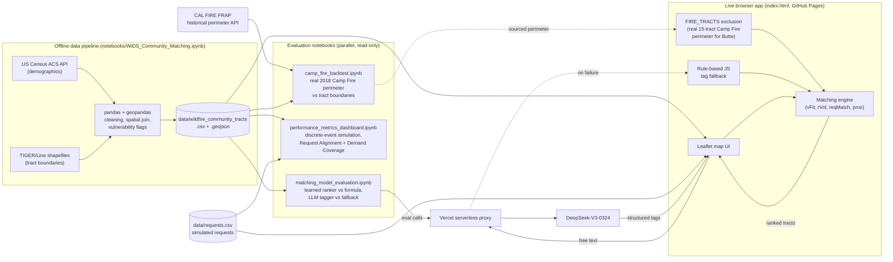
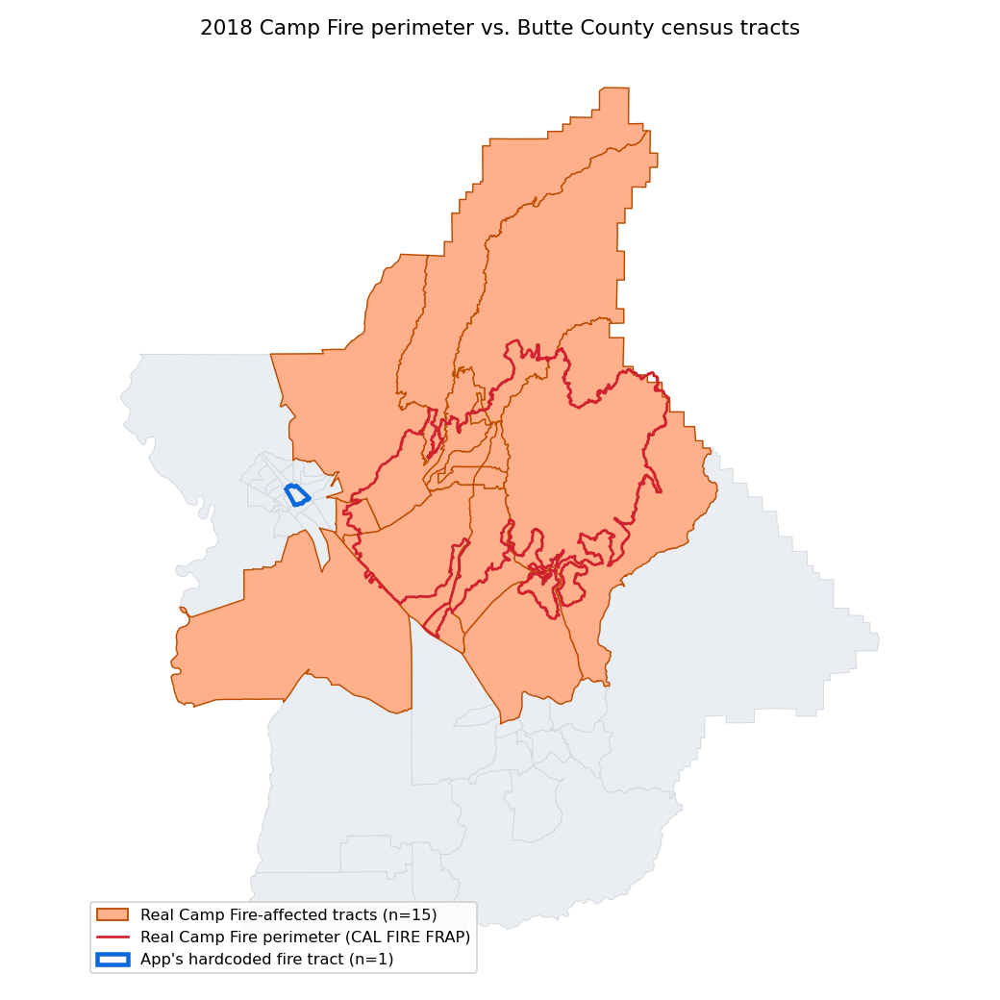
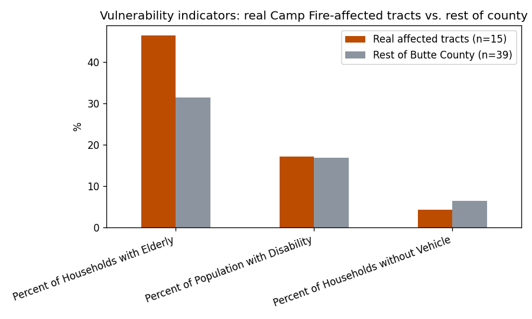

<h1 align="center">Community Evacuation Resource Matcher (CERM)</h1>
<p align="center"><em>WiDS Datathon 2026 · Team "Ramblin' Pathfinders" · Georgia Institute of Technology</em></p>
<p align="center">🔗 <a href="https://letitia-chang.github.io/cerm-wildfire-evacuation-tool/"><strong>Live Demo</strong></a></p>


---

## Overview

CERM is a community-driven web app that connects people offering evacuation help (transportation, medical supplies, volunteer labor) with the census tracts that need it most during a wildfire. It combines demographic vulnerability data, live request signals, and geographic proximity into a single ranked recommendation, and uses an LLM to turn free-text requests and offers into structured tags.

Existing wildfire tools focus on fire prediction and monitoring, not on real-time, community-level coordination of assistance. CERM integrates rule-based matching with lightweight LLM-assisted categorization to recommend high-priority census tracts, emphasizing **decision support rather than automated control** — it helps people make informed choices while protecting privacy and avoiding misuse in active fire zones.

The project was built for the **WiDS Datathon 2026 — Route 1: Accelerating Equitable Evacuations**, which asks: *how can we reduce delays in evacuation alerts and improve response times for the communities most at risk?*

## Problem Statement

Wildfire evacuations disproportionately impact elderly residents, people with disabilities, and households without vehicle access — groups that face structural barriers like limited mobility, lack of transportation, or reduced access to timely information. Existing tools (fire perimeter tracking, evacuation alerts) provide situational awareness but don't address a fundamental coordination gap: **how can communities organize in real time to help vulnerable residents evacuate?**

CERM addresses that gap directly: it surfaces where help is most needed and lets individuals and community groups self-organize to provide it. It's a decision-support system, not an automated dispatcher, designed for in-the-moment use with a built-in safeguard — active fire zones are excluded from matching entirely, and residents there are redirected to emergency services (911) instead.

## Key Features

- **Interactive census-tract map** (Leaflet.js) for Butte, Shasta, and Riverside counties, color-coded by need
- **Two user roles**: Requesters describe what they need; Helpers describe what they can offer
- **LLM-based free-text tagging** — DeepSeek-V3 extracts service/resource/beneficiary tags from natural language, used only for categorization (not decision-making) to limit hallucination risk
- **Weighted matching engine** — ranks tracts using `0.25·vulnerability fit + 0.15·request volume + 0.25·request match + 0.35·proximity`
- **Fire-aware safety constraint** — tracts inside an active fire perimeter are excluded from matching and redirected to emergency guidance
- **Privacy by design** — requesters see only aggregate counts per tract; helpers see simulated addresses with no personal contact info
- **Rule-based fallback** — if the LLM call fails, a keyword-based extractor keeps the demo functional

## Data Sources

CERM draws on three data sources:

**Fire perimeter data** — historical fire perimeter records from Watch Duty and CalFire determine which census tracts sit within an active fire zone and drive the matching engine's safety constraint (see [Fire-Aware Safety Constraint](#fire-aware-safety-constraint) below). The [Camp Fire backtest](#model-evaluation-and-validation) goes further and pulls the official CAL FIRE FRAP historical perimeter database directly.

**Demographic vulnerability data** — tract-level data from the American Community Survey (US Census Bureau) captures three indicators: percentage of residents aged 65+, percentage with disabilities, and percentage of households without vehicle access. Counties were selected for having at least 50 census tracts and meaningful variation in at least one of these dimensions — enough granularity to distinguish high-need areas from typical ones, and enough demographic heterogeneity for tract-level prioritization to be informative. Prototype development focused on three counties with elevated wildfire risk: **Butte, Shasta, and Riverside**.

**Request data (prototype)** — user-submitted and simulated requests capture unmet needs such as transportation, medical assistance, and supplies, aggregated at the census-tract level into two signals: request volume and the categories of need that remain unresolved.

## System Design and Methodology

The system has three components: a user input layer, an LLM-based categorization pipeline, and a matching engine.

### User Input Layer

Two types of users interact with the system.

**Requesters**
- submit free-text descriptions of their needs and
- can view aggregate demand across census tracts.

**Helpers**
- submit descriptions of the resources or services they can offer and
- receive ranked recommendations for where to direct their assistance.

### LLM-Based Categorization

A large language model (DeepSeek-V3-0324) converts free-text into structured, machine-readable tags. **The LLM is used exclusively for categorization (not decision-making), which limits hallucination risk and preserves interpretability.**

The model is prompted to extract three tag categories:
- **Service tags**: transportation, mobility assistance, heavy lifting, medical, food distribution, volunteer labor, childcare
- **Resource tags**: water, food, medicine, clothing, fuel, equipment, tools, first aid
- **Beneficiary tags**: elderly, disability, no vehicle, families, children, general

The prompt instructs the model to return only valid JSON with no additional explanation, ensuring consistent structured output for downstream matching.

### Matching Engine

Each census tract is scored against a helper's input using four weighted components:

*Score = 0.25 × vFit + 0.15 × rVol + 0.25 × reqMatch + 0.35 × prox*

Ranks tracts and displays the top recommendations to the helper. Proximity carries the highest weight to minimize travel time under emergency conditions.

### Fire-Aware Safety Constraint

To prevent misuse, census tracts currently within active fire perimeters are excluded from matching entirely. Users located in these areas are redirected to emergency services and immediate evacuation guidance rather than community coordination features.


This constraint originally shipped with a single hardcoded placeholder tract per county. The [Camp Fire backtest](#model-evaluation-and-validation) found that placeholder didn't even overlap the real 2018 Camp Fire perimeter for Butte County — it's since been replaced with the actual 15-tract perimeter pulled from CAL FIRE's historical database.

### Community Coordination Mechanism

Users can mark when they are providing help and when requests have been fulfilled, allowing demand signals to update dynamically. The system **does not enforce allocation**, but provides recommendations while users retain full decision-making control.

### Privacy Protection

Privacy is protected by design. In the current prototype:

- **Requesters**: see only the total number of open requests per census tract, and no details of individual requests
- **Helpers**: see a request's address (all addresses in the prototype are simulated using non-residential locations) but no personal contact information

Future versions of the system will strengthen these protections further:
- Before a match is made, helpers will see only a rough area, not a precise address
- Full address and contact details will only be revealed once both sides have agreed to connect
- User identity authentication will be introduced to add another layer of trust and accountability

## Tech Stack

| Layer | Technology |
|---|---|
| Frontend | HTML5, CSS3, vanilla JavaScript, [Leaflet.js](https://leafletjs.com/) |
| Hosting | GitHub Pages (static site, no build step) |
| LLM | DeepSeek-V3-0324, called through a Vercel serverless proxy (keeps the API key server-side, out of this repo) |
| Geocoding | OpenStreetMap Nominatim |
| Data pipeline / EDA | Python — pandas, geopandas, NumPy, scikit-learn, seaborn, matplotlib (Jupyter notebooks) |
| Data sources | US Census ACS 5-Year (2023), Census TIGER/Line shapefiles, CalFire / Watch Duty fire perimeters, CAL FIRE FRAP historical perimeters, simulated request data |

## Architecture



## Setup Instructions

### Run the demo locally

The frontend fetches local data files, so it needs to be served over HTTP (opening `index.html` directly via `file://` will fail on the fetch calls):

```bash
python -m http.server 8000
# then open http://localhost:8000 in a browser
```

### Re-run the data pipeline (optional)

The processed data (`data/wildfire_community_tracts.csv/.geojson`) is already committed, so this step is only needed if you want to regenerate it or extend it to new counties.

```bash
python -m venv venv && source venv/bin/activate
pip install -r requirements.txt
jupyter notebook notebooks/WiDS_Community_Matching.ipynb
```

The notebook's first cell pulls raw ACS demographic data directly from the Census API. You'll also need the [2025 CA TIGER/Line tract shapefile](https://www2.census.gov/geo/tiger/TIGER2025/TRACT/) saved locally as `tl_2025_06_tract/` next to the notebook — both raw inputs are gitignored due to size.

## Demo Instructions

🔗 **Live demo:** [letitia-chang.github.io/cerm-wildfire-evacuation-tool](https://letitia-chang.github.io/cerm-wildfire-evacuation-tool/)

1. Open the live demo above, or serve the app locally (see Setup Instructions), and choose a county (Butte, Shasta, or Riverside).
2. Pick a role: **Requester** (describe a need in free text) or **Helper** (describe what you can offer).
3. The LLM extracts structured tags from your text, and the matching engine ranks census tracts by need, fit, and proximity.
4. Click a tract marked as an active fire zone to see the safety constraint block matching and redirect to emergency guidance instead.

## Screenshots

| | |
|---|---|
|  Full helper flow: offer → tags → ranked tracts |  Requester submitting a free-text need |
|  Helper reviewing and accepting a match |  Matching engine ranking tracts |
|  Fire-perimeter tracts excluded from matching |  CERM vs. single-factor and random-matching baselines |
|  Vulnerability flag prevalence by county |  Vulnerability flag co-occurrence heatmap |

## Model Evaluation and Validation

The project proposed five performance metrics and two adoption metrics to evaluate CERM. Only some of them were ever actually computed — the rest require production telemetry a static prototype with no backend doesn't produce. This section defines what was proposed, and separates what's real from what's still aspirational.

### Proposed Metrics

**Performance**
- **Evacuation Efficiency** — improvement in evacuation time relative to a historical baseline
- **Request Alignment Score** — % of helpers assigned to tracts with a category-matched request
- **Demand Coverage** — % of requests resolved within a time window *T*
- **Vulnerable Group Demand Coverage** — Demand Coverage, calculated separately for elderly, disability, and no-vehicle groups
- **Mean Accepted Recommendation Rank** — average rank of the tract a helper ultimately picks (ideal: close to 1)

**Adoption**
- **User Signups** — registered users and quarter-over-quarter growth
- **Active Users During Fire Events** — users actively using the platform during a real wildfire incident

### What Was Actually Measured

Three notebooks turn as many of the metrics above as possible into real numbers, using the live app's actual matching logic instead of a simplified stand-in:

**1. Learned ranker vs. the fixed-weight formula.** [`notebooks/matching_model_evaluation.ipynb`](notebooks/matching_model_evaluation.ipynb) ports the live formula faithfully from `index.html` and asks whether it can be improved on. A gradient-boosted model trained on the same four inputs (vFit, rVol, reqMatch, prox) was benchmarked against the hand-picked weights and a learned linear model, using a documented synthetic ground truth built around one hypothesis: vulnerability should only matter when it's paired with an actual unmet matching request, not in isolation. The tree model won on every ranking metric tested (NDCG@3, MRR, Spearman correlation) — and directly speaks to **Mean Accepted Recommendation Rank**, since under that hypothesis the fixed formula doesn't reliably put the best tract first.

<p align="center">
  
  
</p>

**2. DeepSeek LLM tagger vs. rule-based fallback.** Against 20 hand-labeled free-text offers (including informal phrasing), the LLM scored a mean F1 of 0.79 versus 0.55 for the rule-based fallback on service + beneficiary tag extraction — a meaningful quality gap, though worth confirming on a larger labeled set before concluding it's worth the latency and cost of every request.

<p align="center">
  
</p>

This evaluation also surfaced a real operational issue: the shared LLM proxy ran out of free-tier credits mid-run. The notebook now caches every real response to [`notebooks/llm_tag_cache.json`](notebooks/llm_tag_cache.json) so re-running it doesn't re-burn quota — a small illustration of why the app's rule-based fallback exists at all.

**3. Performance metrics, actually measured.** [`notebooks/performance_metrics_dashboard.ipynb`](notebooks/performance_metrics_dashboard.ipynb) runs a discrete-event simulation (real requests + real matching logic, with simulated arrival times since no timestamps exist anywhere in the data) to turn two of the metrics above into real numbers: **Request Alignment Score: 79.7%**, and a **Demand Coverage** curve broken out by vulnerability flag (directly answering **Vulnerable Group Demand Coverage**).

<p align="center">
  
</p>

The standout result: every vulnerable-flagged group (elderly, disability, no-vehicle) gets resolved faster than the overall population — not an engineered outcome, just a side effect of `vFit` boosting those tracts' scores. That's the equity-by-design claim in the Overview, actually measured instead of asserted.

**4. Backtest against a real disaster: the 2018 Camp Fire.** The three notebooks above all validate against simulated data, since the app has no real usage history. [`notebooks/camp_fire_backtest.ipynb`](notebooks/camp_fire_backtest.ipynb) instead checks two of CERM's core design decisions against the deadliest fire in California history — which happened in Butte County, one of the three counties this app already covers. Using the real historical fire perimeter (fetched live from CAL FIRE's FRAP database) intersected against the real tract boundaries already in this repo:

<p align="center">
  
</p>

The real fire crossed **15 Butte County census tracts**. The single hardcoded "fire zone" tract the app originally used for Butte wasn't one of them — it sat outside the burn area entirely. That's real evidence, not a hypothetical, for why fire-zone exclusion needs to come from a live perimeter feed rather than a constant in the source; `FIRE_TRACTS['Butte']` in `index.html` now uses the real 15-tract perimeter found here. The backtest also turned up a concrete, one-line bug along the way: the app's fire-warning banner displayed "Census Tract 21" (which *is* a real affected tract) while the GEOID actually driving the exclusion logic pointed to Census Tract 7 — the two had never been kept in sync. Both have since been fixed.

<p align="center">
  
</p>

On the demographic side, the real ACS data shows the affected tracts run meaningfully higher on elderly households (46.5% vs. 31.4% for the rest of the county) — consistent with the well-documented fact that 80% of the Camp Fire's 85 fatalities were over 65. Disability and no-vehicle rates don't show the same pattern in this event, a useful, honest caveat against treating `vFit`'s three flags as interchangeable evidence of risk.

### Original Baseline Comparison

Separately, the team's original datathon submission compared CERM's weighted formula against single-factor and random-matching baselines in simulation:


CERM — accounting for both distance and demographic vulnerability — outperformed the single-factor methods and the random-matching baseline. From that simulation and early testing: strong performance in high-engagement areas with sufficient volunteer supply; performance decreases in areas with low volunteer density or highly variable/complex needs.

### What's Not Measurable Here

**Evacuation Efficiency** and both **adoption metrics** require real deployment telemetry — before/after evacuation timestamps, signup and session logs — that a static prototype with no backend produces. Rather than fabricate numbers for those, the notebooks name the gap directly; see Future Work below.

## Limitations and Future Improvements

**Limitations**
- Relies on aggregated census data with no household-level precision
- Uses simulated request data in the prototype; no real-world validation yet
- Static scoring weights, not tuned to specific disaster contexts
- No real-time fire spread modeling
- LLM misclassification risk, particularly for ambiguous or informal language

**Future work**
- Integrate real-time shelter and emergency data (Cal OES, Red Cross)
- Expand to additional counties and states
- Add road accessibility and geographic isolation features
- Run retrospective evaluation against additional historical evacuation scenarios
- Tune matching weights dynamically from real-world feedback
- Add production telemetry (timestamps, signup/session logs) so Evacuation Efficiency and the adoption metrics can be computed for real

## Conclusion and Impact

This project demonstrates how a lightweight, interpretable system can support real-time, community-driven evacuation assistance during wildfire events. By combining demographic vulnerability signals, live request data, and geographic proximity within a transparent scoring framework, the system bridges the gap between fire awareness tools and on-the-ground community coordination.

The system has the potential to:
- improve evacuation support access for vulnerable populations,
- enable faster decentralized response through community self-organization, and
- provide meaningful decision support under time pressure, without over-automating choices that carry real human stakes.

## References

[1] Melton, C. C., et al. (2023). Wildfires and older adults: A scoping review of impacts, risks, and interventions. International Journal of Environmental Research and Public Health.

[2] Rad, A. M., et al. (2023). Social vulnerability of populations exposed to wildfires in the United States.

[3] Matsuo, Y. (2025). Evacuation and transportation barriers among vulnerable populations in disasters.

[4] UCLA Institute of Transportation Studies. (2025). Wildfire recovery and resilience strategies for vulnerable communities.

[5] Sun, Y., et al. (2024). Social vulnerabilities and wildfire evacuations: A case study of the 2019 Kincade Fire.

[6] FEMA. (2011). A Whole Community Approach to Emergency Management: Principles, Themes, and Pathways for Action.

[7] National Academies of Sciences, Engineering, and Medicine. (2019). Evacuation Decision Making in Disasters.

[8] Aldrich, D. P., & Meyer, M. A. (2015). Social capital and community resilience. American Behavioral Scientist.

## Project Deliverables

The write-up above accompanied a Kaggle-hosted datathon submission with the following supporting materials, included in [`reports/`](reports/):

- [Technical Presentation](<reports/Technical Presentation - Georgia Tech.pdf>)
- [Solution Pitch Deck](<reports/Solution Pitch - Georgia Tech.pptx.pdf>)
- [Poster](<reports/Poster - Georgia Tech.docx>)

## Team

**Team Name**: Ramblin' Pathfinders
**University**: Georgia Institute of Technology
**Term**: Spring 2026

| Name             | Contributions                                                                  |
|------------------|--------------------------------------------------------------------------------|
| Riya Bharathwaj  | EDA, Feature engineering, modeling, building solution, presentation prep       |
| Ting-ya Chang    | EDA, geospatial joins, Research/Outreach, building solution, presentation prep |
| Saehee Eom       | EDA, Feature engineering, modeling, building solution, presentation prep       |
| Tanmayee Kolli   | EDA, Research/Outreach, building solution, presentation prep                   |
| Simran Mallik    | EDA, preprocessing, Research/Outreach, building solution, presentation prep    |
