<p align="center">
  
</p>

<h1 align="center">Community Evacuation Resource Matcher (CERM)</h1>
<p align="center"><em>WiDS Datathon 2026 · Team "Ramblin' Pathfinders" · Georgia Institute of Technology</em></p>


---

## Overview

CERM is a community-driven web app that connects people offering evacuation help (transportation, medical supplies, volunteer labor) with the census tracts that need it most during a wildfire. It combines demographic vulnerability data, live request signals, and geographic proximity into a single ranked recommendation, and uses an LLM to turn free-text requests/offers into structured tags.

The project was built for the **WiDS Datathon 2026 — Route 1: Accelerating Equitable Evacuations**, which asks: *how can we reduce delays in evacuation alerts and improve response times for the communities most at risk?*

## Problem Statement

Wildfire evacuations disproportionately impact elderly residents, people with disabilities, and households without vehicle access — groups that face structural barriers like limited mobility or reduced access to timely information. Existing tools (fire perimeter tracking, evacuation alerts) provide situational awareness but don't address a coordination gap: **how can communities organize in real time to help vulnerable residents evacuate?**

CERM is a decision-support system, not an automated dispatcher — it surfaces where help is needed most and lets people self-organize, while excluding active fire zones from matching (residents there are redirected to emergency services instead).

## Key Features

- **Interactive census-tract map** (Leaflet.js) for Butte, Shasta, and Riverside counties, color-coded by need
- **Two user roles**: Requesters describe what they need; Helpers describe what they can offer
- **LLM-based free-text tagging** — DeepSeek-V3 extracts service/resource/beneficiary tags from natural language, used only for categorization (not decision-making) to limit hallucination risk
- **Weighted matching engine** — ranks tracts using `0.25·vulnerability fit + 0.15·request volume + 0.25·request match + 0.35·proximity`
- **Fire-aware safety constraint** — tracts inside an active fire perimeter are excluded from matching and redirected to emergency guidance
- **Privacy by design** — requesters see only aggregate counts per tract; helpers see simulated addresses with no personal contact info
- **Rule-based fallback** — if the LLM call fails, a keyword-based extractor keeps the demo functional

## Model Evaluation Highlights

The live app's matching engine is a fixed linear formula, and its tagger has two extraction paths (LLM + rule-based fallback). [`notebooks/matching_model_evaluation.ipynb`](notebooks/matching_model_evaluation.ipynb) ports both faithfully from `index.html` and asks whether either can be improved on or is worth its cost:

**1. Learned ranker vs. the fixed-weight formula.** A gradient-boosted model trained on the same four inputs the live formula uses (vFit, rVol, reqMatch, prox) was benchmarked against the hand-picked weights and a learned linear model, using a documented synthetic ground truth built around one hypothesis: vulnerability should only matter when it's paired with an actual unmet matching request, not in isolation. The tree model won on every ranking metric tested (NDCG@3, MRR, Spearman correlation) because it's the only one of the three that can represent that interaction — visible directly in the partial dependence plot below.

<p align="center">
  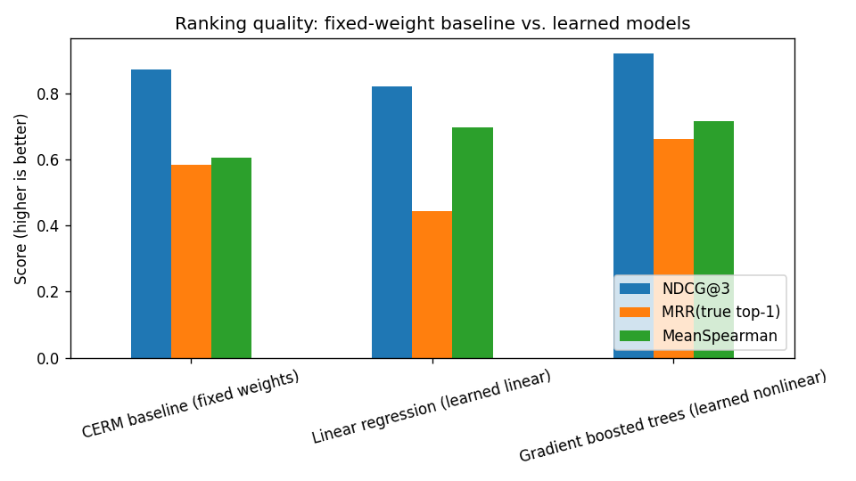
  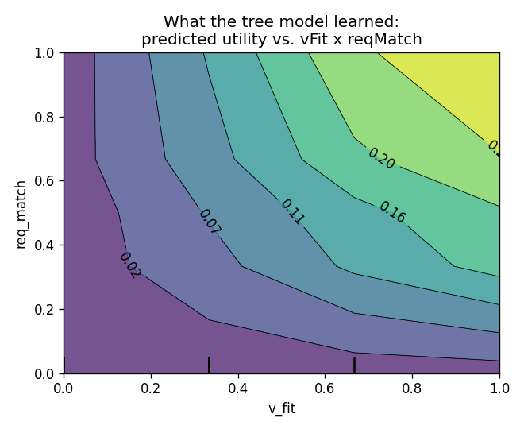
</p>

**2. DeepSeek LLM tagger vs. rule-based fallback.** Against 20 hand-labeled free-text offers (including informal phrasing), the LLM scored a mean F1 of 0.79 versus 0.55 for the rule-based fallback on service + beneficiary tag extraction — a meaningful quality gap, though worth confirming on a larger labeled set before concluding it's worth the latency and cost of every request.

<p align="center">
  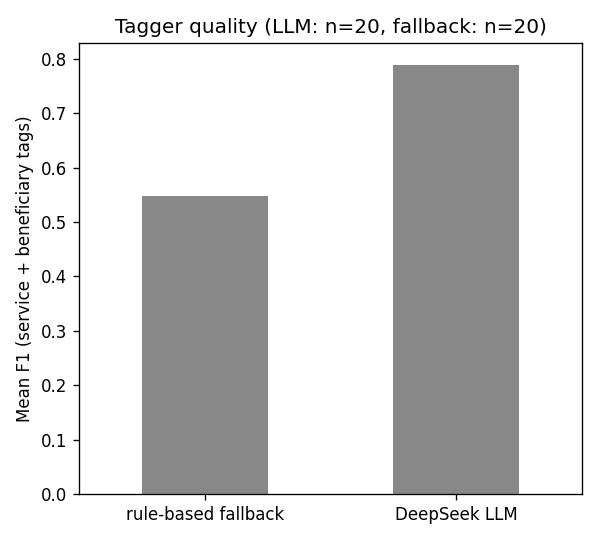
</p>

This evaluation also surfaced a real operational issue: the shared LLM proxy ran out of free-tier credits mid-run. The notebook now caches every real response to [`notebooks/llm_tag_cache.json`](notebooks/llm_tag_cache.json) so re-running it doesn't re-burn quota — a small illustration of why the app's rule-based fallback exists at all.

**3. Performance metrics, actually measured.** The README originally *proposed* five performance metrics and two adoption metrics without computing any of them — the app has no backend or event log to compute them from. [`notebooks/performance_metrics_dashboard.ipynb`](notebooks/performance_metrics_dashboard.ipynb) runs a discrete-event simulation (real requests + real matching logic, with simulated arrival times since no timestamps exist anywhere in the data) to turn three of them into real numbers: **Request Alignment Score: 79.7%**, and a Demand Coverage curve broken out by vulnerability flag.

<p align="center">
  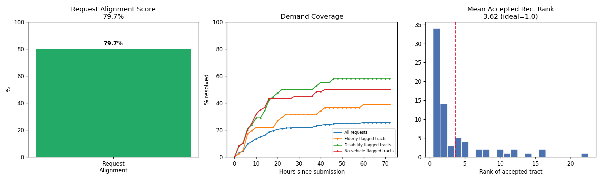
</p>

The standout result: every vulnerable-flagged group (elderly, disability, no-vehicle) gets resolved faster than the overall population — not an engineered outcome, just a side effect of `vFit` boosting those tracts' scores. That's the "equity-by-design" claim in the abstract, actually measured instead of asserted. The notebook is equally explicit about what it *can't* measure: Evacuation Efficiency and the two adoption metrics require real deployment telemetry (before/after evacuation timestamps, signup/session logs) that a static prototype with no backend doesn't produce — rather than fabricate numbers for those, it names the gap and points to the relevant Future Work item.

## Tech Stack

| Layer | Technology |
|---|---|
| Frontend | HTML5, CSS3, vanilla JavaScript, [Leaflet.js](https://leafletjs.com/) |
| Hosting | GitHub Pages (static site, no build step) |
| LLM | DeepSeek-V3-0324, called through a Vercel serverless proxy (keeps the API key server-side, out of this repo) |
| Geocoding | OpenStreetMap Nominatim |
| Data pipeline / EDA | Python — pandas, geopandas, NumPy, scikit-learn, seaborn, matplotlib (Jupyter notebook) |
| Data sources | US Census ACS 5-Year (2023), Census TIGER/Line shapefiles, CalFire / Watch Duty fire perimeters, simulated request data |

## Architecture

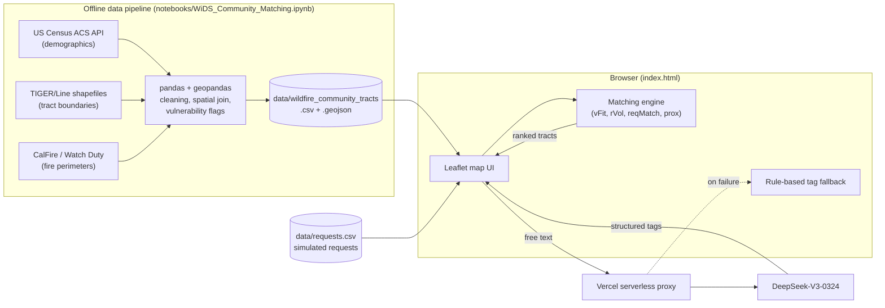

## Setup Instructions

### Run the demo locally

The frontend fetches local data files, so it needs to be served over HTTP (opening `index.html` directly via `file://` will fail on the fetch calls):

```bash
python -m http.server 8000
# then open http://localhost:8000 in a browser
```

### Re-run the data pipeline (optional)

The processed data (`data/wildfire_community_tracts.csv/.geojson`) is already committed, so this step is only needed if you want to regenerate it or extend it to new counties.

```bash
python -m venv venv && source venv/bin/activate
pip install -r requirements.txt
jupyter notebook notebooks/WiDS_Community_Matching.ipynb
```

The notebook's first cell pulls raw ACS demographic data directly from the Census API. You'll also need the [2025 CA TIGER/Line tract shapefile](https://www2.census.gov/geo/tiger/TIGER2025/TRACT/) saved locally as `tl_2025_06_tract/` next to the notebook — both raw inputs are gitignored due to size.

## Demo Instructions

1. Serve the app locally (see above) and choose a county (Butte, Shasta, or Riverside).
2. Pick a role: **Requester** (describe a need in free text) or **Helper** (describe what you can offer).
3. The LLM extracts structured tags from your text, and the matching engine ranks census tracts by need, fit, and proximity.
4. Click a tract marked as an active fire zone to see the safety constraint block matching and redirect to emergency guidance instead.

## Screenshots

| | |
|---|---|
|  Full helper flow: offer → tags → ranked tracts | 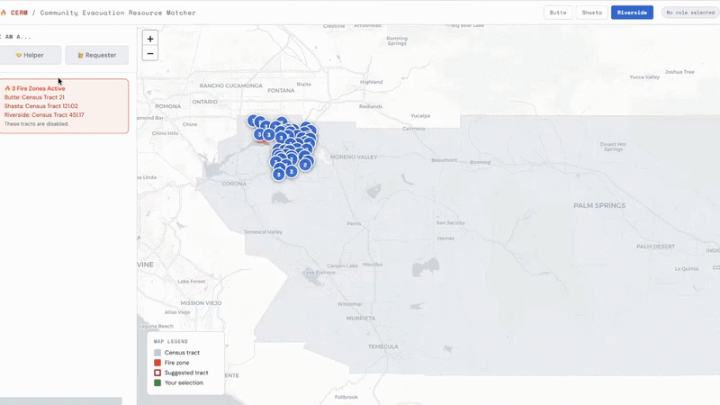 Requester submitting a free-text need |
| 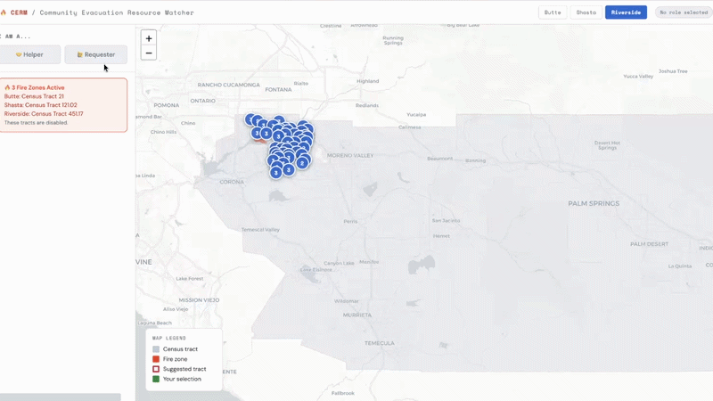 Helper reviewing and accepting a match | 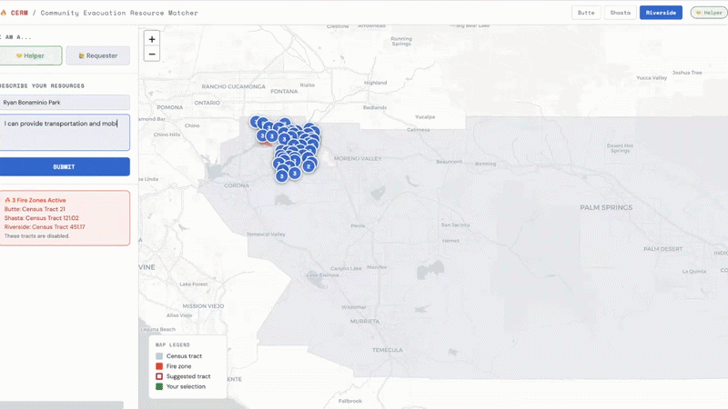 Matching engine ranking tracts |
| 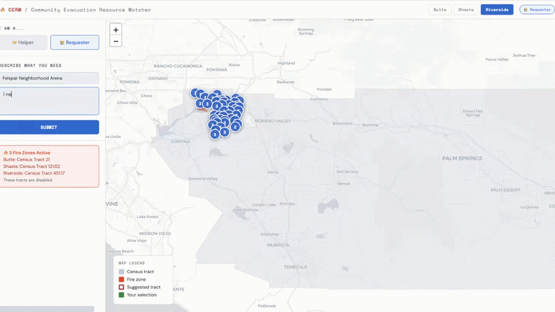 Fire-perimeter tracts excluded from matching |  CERM vs. single-factor and random-matching baselines |
| 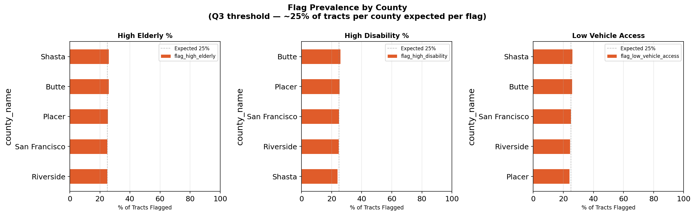 Vulnerability flag prevalence by county | 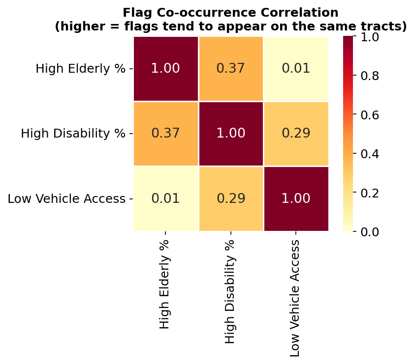 Vulnerability flag co-occurrence heatmap |

## Limitations and Future Improvements

**Limitations**
- Relies on aggregated census data with no household-level precision
- Uses simulated request data in the prototype; no real-world validation yet
- Static scoring weights, not tuned to specific disaster contexts
- No real-time fire spread modeling
- LLM misclassification risk, particularly for ambiguous or informal language

**Future work**
- Integrate real-time shelter and emergency data (Cal OES, Red Cross)
- Expand to additional counties and states
- Add road accessibility and geographic isolation features
- Run retrospective evaluation against historical evacuation scenarios
- Tune matching weights dynamically from real-world feedback

---

# Full Project Report

The sections below are the full write-up submitted for the WiDS Datathon 2026, covering the data sources, methodology, evaluation metrics, and references in more depth.

## Abstract
Wildfires in California create urgent, high-stakes evacuation scenarios where timely and equitable access to support resources can significantly impact outcomes. However, existing tools primarily focus on fire prediction and monitoring, rather than enabling real-time, community-level coordination of assistance.

In this project, we present a **community-driven evacuation support system** that connects individuals offering help with neighborhoods in need, using a combination of demographic vulnerability data, real-time request signals, and geographic proximity. Our approach integrates **rule-based matching with lightweight LLM-assisted categorization** to recommend high-priority census tracts where assistance is most needed.

Unlike fully automated systems, our solution emphasizes **decision support rather than control**, enabling users to make informed choices while ensuring privacy and avoiding misuse in high-risk active fire zones.

## 1. Introduction
Wildfire evacuations disproportionately impact vulnerable populations, including:
- elderly residents,
- people with disabilities,
- and households without vehicle access.

These groups often face **structural barriers to evacuation**, such as limited mobility, lack of transportation, or reduced access to timely information.

While critical tools such as fire perimeter tracking and evacuation alerts provide situational awareness, they do not address a fundamental coordination gap: how can communities **organize in real time to help vulnerable residents evacuate?**

This project directly addresses that question by designing a system that:
- surfaces **where help is most needed**, and
- enables individuals and community groups to **self-organize and provide assistance**.

The system is designed for **in-the-moment use** and includes safeguards to ensure it is **not used in active emergency zones**, where emergency services (e.g., 911) and immediate evacuation are more appropriate.

## 2. Data Analysis
The system draws on three primary data sources:

### Fire Perimeter Data
Historical records on fire perimeter are sourced from **Watch Duty** and **CalFire**. This data was used to determine which census tracts are affected by wildfire and are used to enforce the system's safety constraint (see Section 3.4).

### Demographic Vulnerability Data
Census tract-level demographic data from the **American Community Survey** and the **US Census Bureau** captures three indicators of structural evacuation vulnerability:
- Percentage of residents aged 65 or older
- Percentage of residents with disabilities
- Percentage of households without vehicle access

Counties with at least 50 census tracts and meaningful variation in at least one demographic dimension (elderly %, disability %, or car-free households) were selected for analysis. The tract count requirement ensures the county has enough geographic granularity to meaningfully distinguish high-need areas from typical ones. The variation requirement ensures the county has real demographic heterogeneity. Without it, all tracts look alike and resource prioritization across the county becomes uninformative.

Our prototype development focused on three counties with elevated wildfire risk: **Butte, Shasta, and Riverside**.

### Request Data (Prototype)
User-submitted and simulated requests capture unmet needs such as transportation, medical assistance, and supplies.

These are aggregated at the census tract level to produce two signals:

- the volume of active requests and
- the categories of need that remain unresolved.

## 3. System Design and Methodology
The system consists of three components: a user input layer, an LLM-based categorization pipeline, and a matching engine.

### 3.1 User Input Layer
Two types of users interact with the system.

**Requesters**
- submit free-text descriptions of their needs and
- can view aggregate demand across census tracts.

**Helpers**
- submit descriptions of the resources or services they can offer and
- receive ranked recommendations for where to direct their assistance.

### 3.2 LLM-Based Categorization
A large language model (DeepSeek-V3-0324) converts free-text into structured, machine-readable tags. **The LLM is used exclusively for categorization (not decision-making) which limits hallucination risk and preserves interpretability.**

The model is prompted to extract three tag categories:
- **Service tags**: transportation, mobility assistance, heavy lifting, medical, food distribution, volunteer labor, childcare
- **Resource tags**: water, food, medicine, clothing, fuel, equipment, tools, first aid
- **Beneficiary tags**: elderly, disability, no vehicle, families, children, general

The prompt instructs the model to return only valid JSON with no additional explanation, ensuring consistent structured output for downstream matching.

### 3.3 Matching Engine
Each census tract is scored against a helper's input using four weighted components:

**Final Score**

*Score = 0.25 × vFit + 0.15 × rVol + 0.25 × reqMatch + 0.35 × prox*

Ranks tracts and displays the top recommendations to the helper. Proximity carries the highest weight to minimize travel time under emergency conditions.

### 3.4 Fire-Aware Safety Constraint
To prevent misuse, census tracts currently within active fire perimeters are excluded from matching entirely.

Users located in these areas are redirected to emergency services and immediate evacuation guidance rather than community coordination features.


### 3.5 Community Coordination Mechanism
Users can mark when they are providing help and when requests have been fulfilled, allowing demand signals to update dynamically.

The system **does not enforce allocation**, but provides recommendations while users retain full decision-making control.

### 3.6 Privacy Protection
Privacy is protected by design. In the current prototype:

- **Requesters**: see only the total number of open requests per census tract, and no details of individual requests
- **Helpers**: see a request's address (all addresses in the prototype are simulated using non-residential locations) but no personal contact information

Future versions of the system will strengthen these protections further:
- Before a match is made, helpers will see only a rough area, not a precise address
- Full address and contact details will only be revealed once both sides have agreed to connect
- User identity authentication will be introduced to add another layer of trust and accountability

### 3.7 Technical Implementation

**Frontend**

The frontend is a single-page application built with HTML, CSS, and JavaScript, using Leaflet.js for interactive mapping and hosted on GitHub Pages.

**Backend**

The backend is a Python data pipeline (pandas, geopandas) handling census data cleaning and spatial processing. LLM calls are proxied through a Vercel serverless function.

## 4. Evaluation and Performance Metrics
### 4.1. Metrics

Due to the absence of real-time ground-truth evacuation outcomes, we propose **five performance metrics and two adoption metrics** to evaluate the effectiveness of our system. The performance metrics focus on how well the platform supports evacuation coordination and resource matching during wildfire events, while the adoption metrics evaluate real-world usage and growth from a deployment perspective.

#### 4.1.1. Performance Metrics
**a. Evacuation Efficiency**

Measures the improvement in evacuation time relative to historical baselines.

$$\frac{\text{Avg. Evacuation Time Difference}}{\text{Avg. Evacuation Time Before Deployment}} \times 100$$

This metric estimates how much evacuation time could be reduced through improved coordination and faster resource allocation enabled by the platform.

**b. Request Alignment Score**

$$\frac{\text{Helpers assigned to tracts with category-matched requests}}{\text{Total helpers assigned to tracts with requests}} \times 100$$

Evaluates how effectively the matching engine assigns helpers to locations where their offered resources directly correspond to the needs expressed by residents.

**c. Demand Coverage**
$$\frac{\text{Requests resolved within T hours}}{\text{Total distinct requests submitted within T hours}} \times 100$$

Measures the proportion of requests that are successfully addressed within a given time window, indicating how well the system mobilizes community resources during an emergency.

**d. Vulnerable Group Demand Coverage**
Demand Coverage calculated separately for each vulnerable demographic group:
- Elderly residents
- People with disabilities
- Households without vehicles

This metric ensures that support reaches the populations most likely to face evacuation barriers.

**e. Mean Accepted Recommendation Rank**
Average rank of the census tracts that helpers ultimately choose after receiving recommendations from the system. Ideally, this value should be close to 1, meaning users frequently accept the highest-ranked recommendations. Higher values may indicate that the recommendation algorithm is less aligned with user decisions.

#### 4.1.2 Adoption Metrics
**a. User Signups**

Number of registered users on the platform and quarter-over-quarter (QoQ) growth. This metric reflects overall community engagement and the scalability of the platform.

**b. Active Users During Fire Events**

Number of users who actively utilize the platform during a wildfire incident. This metric captures real-world relevance and indicates whether the system is being used when it matters most, during active emergencies.

### 4.2. Performance Insights


CERM takes distance and vulnerability of demographics of areas into account, beating the other single-factor methods or random matching baseline.

From simulation and early testing:
- Strong performance in high-engagement areas with sufficient volunteer supply
- Performance decreases in areas with:
   - Low volunteer density
   - Highly variable or complex needs

## 5. Conclusion and Impact
This project demonstrates how a lightweight, interpretable system can support **real-time**, **community-driven evacuation assistance** during wildfire events.

By combining demographic vulnerability signals, live request data, and geographic proximity within a transparent scoring framework, the system **bridges the gap between fire awareness tools and on-the-ground community coordination**.

The system has the potential to:
- improve evacuation support access for vulnerable populations,
- enable faster decentralized response through community self-organization, and
- provide meaningful decision support under time pressure, without over-automating choices that carry real human stakes.

## References

[1] Melton, C. C., et al. (2023). Wildfires and older adults: A scoping review of impacts, risks, and interventions. International Journal of Environmental Research and Public Health.

[2] Rad, A. M., et al. (2023). Social vulnerability of populations exposed to wildfires in the United States.

[3] Matsuo, Y. (2025). Evacuation and transportation barriers among vulnerable populations in disasters.

[4] UCLA Institute of Transportation Studies. (2025). Wildfire recovery and resilience strategies for vulnerable communities.

[5] Sun, Y., et al. (2024). Social vulnerabilities and wildfire evacuations: A case study of the 2019 Kincade Fire.

[6] FEMA. (2011). A Whole Community Approach to Emergency Management: Principles, Themes, and Pathways for Action.

[7] National Academies of Sciences, Engineering, and Medicine. (2019). Evacuation Decision Making in Disasters.

[8] Aldrich, D. P., & Meyer, M. A. (2015). Social capital and community resilience. American Behavioral Scientist.

## Project Deliverables

The full write-up above accompanied a Kaggle-hosted datathon submission with the following supporting materials, included in [`reports/`](reports/):

- [Technical Presentation](<reports/Technical Presentation - Georgia Tech.pdf>)
- [Solution Pitch Deck](<reports/Solution Pitch - Georgia Tech.pptx.pdf>)
- [Poster](<reports/Poster - Georgia Tech.docx>)

## Team

**Team Name**: Ramblin' Pathfinders
**University**: Georgia Institute of Technology
**Term**: Spring 2026

| Name             | Contributions                                                                  |
|------------------|--------------------------------------------------------------------------------|
| Riya Bharathwaj  | EDA, Feature engineering, modeling, building solution, presentation prep       |
| Ting-ya Chang    | EDA, geospatial joins, Research/Outreach, building solution, presentation prep |
| Saehee Eom       | EDA, Feature engineering, modeling, building solution, presentation prep       |
| Tanmayee Kolli   | EDA, Research/Outreach, building solution, presentation prep                   |
| Simran Mallik    | EDA, preprocessing, Research/Outreach, building solution, presentation prep    |
